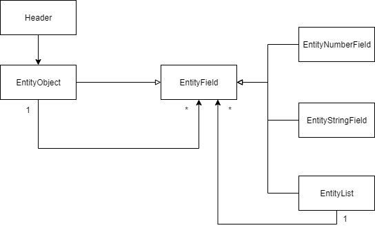

In this repository i have created a program that can write any complex object structure into a comma separated file, by using the internal DSL. An example of the internal DSL:
``` CSharp
var model = builder.Header("NestedListInList.csv").
                Object().
                    String("PortfolioId").
                    String("ClientId").
                    Number("LossResultId").
                    String("AsOfDate").
                    Number("ReturnPct").
                        List("TwrSeries").
                            String("SecId").
                            Number("AccPeriodBasTwrAtMarketPrice").
                                List("NestedObjList").
                                    String("NestedObjectDesc").
                                    Number("NestedObjectValue").
                Build();
```
The input of each method **MUST** correspond to the actual Property names in the complex object structure that you want to write into a Csv file.

The internal DSL currently has the limitation that if you begin moving into a nested construct, such as an object or a list, it is not possible to move back out.

An example of what would **NOT** be possible:

```CSharp
var model = builder.Header("Csv.csv").
                Object().
                    String("PortfolioId"). //Property of Root object
                        Object("NestedObj"). //Property of Root object
                            String("NestedObjectDesc"). //Property of NestedObj
                            Number("NestedObjectValue"). //Property of NestedObj
                    Number("LossResultId"). //ERROR LossResultId is a property of the root object, however we are inside the NestedObj now, and have no way to move out.
                    String("AsOfDate"). //ERROR
                    Number("ReturnPct"). //ERROR
                Build();
```

The Metamodel of the Internal Dsl for Writing Csv Files, looks like this. 



The reason for having both an EntityObject and an EntityList which contain the same properties, is such that when writing the Csv file it is possible to distinguish between a List which requires to write multiple lines of output, and an object which is simply just more fields to the same row of the Csv file.

# Running the Sample Application

To run the application simply go into

MDSD-InternalDSL\bin\Release

And run the CsvInternalDSL.exe file. Which will generate 3 sample .csv files. 
The program.cs file contains the multiple models that are written to the csv files, based on the same complex object structure.

Otherwise, simply open the solution and build it.

## Note on the Builder + Writer

I am aware that both the builder and writer could be improved in readability and maintainability (Lots of reused code that could be moved into methods etc.).